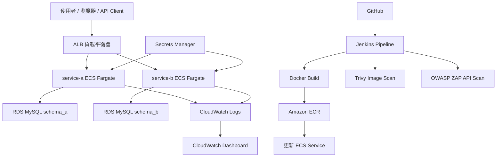

一個以 **AWS ECS Fargate** 為核心的雲端微服務實戰專案，整合 **ALB / HTTPS / RDS / Jenkins CI/CD / ECR / ECS / Secrets Manager / Trivy / OWASP ZAP / CloudWatch**，打造可部署、可觀測、可掃描、可展示的微服務平台。

本專案的目標不是只把 Spring Boot 丟上雲端，而是實作一套更接近正式環境的 **Cloud + DevOps + DevSecOps** 交付流程的展示作品。

---

## 專案亮點

- 使用 **AWS ECS Fargate** 部署 `service-a` / `service-b` 微服務
- 使用 **ALB + Path Routing** 分流：
  - `/api/a/*` → `service-a`
  - `/api/b/*` → `service-b`
- 使用 **ACM + HTTPS + 自訂網域** 建立對外安全 API（含 HTTP → HTTPS redirect）
- 使用 **RDS MySQL**，採 **schema 分離**
- 建立 **Jenkins CI/CD Pipeline**：
  - build
  - docker build
  - push Amazon ECR
  - deploy Amazon ECS
- 支援 **GitHub webhook 自動觸發**
- 支援 **Selective Deployment（git diff 僅部署異動服務）**
- 使用 **AWS Secrets Manager** 管理資料庫密碼
- 整合 **Trivy** 進行 Container Image Scan
- 整合 **OWASP ZAP** 進行 API 弱點掃描（non-blocking）
- 使用 **CloudWatch Logs / Dashboard** 建立基本觀測能力
- 使用 **JSON Logging + Correlation ID** 改善微服務除錯與追蹤
- 使用 **ECS Auto Scaling** 驗證 CPU-based scale out
---
  ### 本專案不僅提供 HTTP API，而是實作完整的 **HTTPS 對外服務架構**，確保傳輸安全與正式環境一致性。

### 實作內容

- 使用 **AWS Certificate Manager (ACM)** 申請 SSL 憑證
- 透過 **DNS Validation** 完成網域驗證
- 將憑證綁定至 **ALB 443 Listener**
- 設定 **HTTP (80) → HTTPS (443) 自動轉導**
- 所有 API 僅透過 HTTPS 對外提供服務

### 架構設計

- TLS Termination 發生於 ALB
- ECS Fargate container 保持內部 HTTP 通訊
- 對外流量強制加密，符合現代 Web 安全標準

### 實務價值

- 模擬正式環境的對外 API 安全設計
- 避免明文傳輸（MitM 風險）
- 提供可被瀏覽器信任的憑證
- 展現雲端平台中「網路安全 + 憑證管理」能力

---

## 架構總覽

本專案採用 AWS 上的微服務部署架構，外部流量先進入 ALB，經由 HTTPS 與 Path Routing 分流到不同 ECS Fargate Service，各服務再依需求存取 RDS MySQL。  
CI/CD 由 Jenkins 負責，當 GitHub 程式碼更新後，自動觸發建置、推送 ECR，並更新 ECS Service。  
安全面則整合 Secrets Manager、Trivy、OWASP ZAP；觀測面則使用 CloudWatch Logs、Dashboard、JSON logging 與 Correlation ID。

---

## Mermaid 架構圖


---

## CI/CD 流程

本專案使用 Jenkins 建立微服務 CI/CD Pipeline，流程如下：

1. 開發者 push 程式碼到 GitHub
2. GitHub webhook 自動觸發 Jenkins Job
3. Jenkins 執行 Maven build
4. 建立 Docker image
5. 推送 image 到 Amazon ECR
6. 更新 ECS Task Definition / Service
7. 觸發新版本 deployment
8. 透過 ALB 驗證新版本是否正常提供服務

另外，Pipeline 支援 **Selective Deployment**，會依 `git diff` 判斷本次只有哪些服務異動，只部署被修改的 service，避免不必要的重佈署。

---

## DevSecOps 流程

本專案在部署流程中加入基本 DevSecOps 能力：

### 1. Secrets Management

- 資料庫密碼不直接寫在 Jenkins 或程式設定檔中
- 改由 **AWS Secrets Manager** 管理
- ECS 執行時動態注入

### 2. Container Security Scan

- 使用 **Trivy** 掃描 Docker image
- 檢視 HIGH / CRITICAL 弱點
- 報告作為 artifact 保留

### 3. API Security Scan

- 使用 **OWASP ZAP** 掃描對外 HTTPS API
- 目前採 **non-blocking** 設計
- 掃描結果作為展示與後續強化依據

---

## Observability

- **CloudWatch Logs**：集中收集各服務日誌
- **CloudWatch Dashboard**：觀察 CPU / Memory / Request 等基礎指標
- **JSON Logging**：統一日誌格式，便於查詢與分析
- **Correlation ID**：支援跨服務請求追蹤，提升除錯效率

---

## Scaling

- 使用 **ECS Auto Scaling**
- 依 CPU 使用率進行 scale out / scale in
- 已透過壓測驗證服務具備基本彈性擴展能力
---
  ## 專案目錄結構
```  
aws-ecs-fargate-microservices-delivery-platform/
├── Jenkinsfile
├── service-a/
│ ├── Dockerfile
│ ├── pom.xml
│ └── src/
├── service-b/
│ ├── Dockerfile
│ ├── pom.xml
│ └── src/
├── jenkins/
│ └── pipeline-config/
├── docs/
│ ├── architecture.md
│ ├── ci-cd.md
│ ├── devsecops.md
│ ├── demo-script.md
│ └── interview-notes.md
└── README.md
```
---
## Deployment 流程

本專案採用 Jenkins + AWS ECS Fargate 進行自動化部署：

### 流程說明

1. 開發者 push 程式碼到 GitHub
2. GitHub webhook 觸發 Jenkins Pipeline
3. Jenkins 執行：
   - Maven build
   - Docker build
   - Trivy image scan
4. 將 image push 至 Amazon ECR
5. 更新 ECS Task Definition（新 image tag）
6. 觸發 ECS Service rollout（Rolling Deployment）
7. ALB 自動將流量導向新版本 container
8. OWASP ZAP 進行 API 安全掃描（non-blocking）

### 驗證方式

- Jenkins pipeline 成功
- ECR 出現新 image tag（build-xx）
- ECS service 出現新 deployment
- ALB `/api/a` `/api/b` 回應正常
- CloudWatch logs 顯示新 container 正常啟動
  
