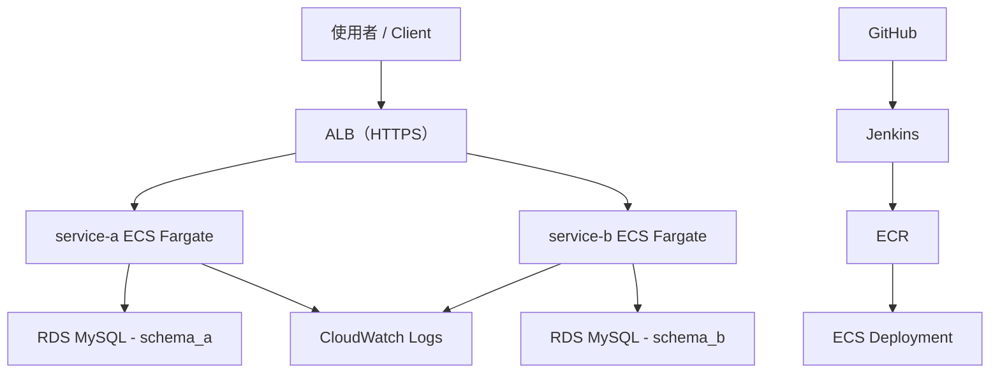

# 系統架構說明（Architecture）

本專案為一個部署於 AWS 的微服務平台，採用 ECS Fargate 作為容器執行環境，並整合 ALB、RDS、CI/CD、DevSecOps 與 Observability。  

---  

## 一、整體架構

## 二、架構設計說明

### 1️⃣ 微服務設計

- service-a：對外 API 入口（模擬 API Gateway）
- service-b：內部服務
- 採用 HTTP 進行 service-to-service 呼叫
- 各服務獨立部署、獨立擴展

👉 重點：**服務解耦（Service Isolation）**

---

### 2️⃣ Load Balancer（ALB）

- 使用 Application Load Balancer
- Path-based routing：

| Path     | Service   |
| -------- | --------- |
| /api/a/* | service-a |
| /api/b/* | service-b |

👉 重點：**流量分流與入口統一**

---

### 3️⃣ Container（ECS Fargate）

- 使用 Fargate（Serverless container）
- 每個 service：
  - 獨立 Task Definition
  - 獨立 ECS Service
- 支援 Rolling Deployment

👉 重點：**無需管理 EC2，專注應用**

---

### 4️⃣ Database（RDS MySQL）

- 使用 Amazon RDS
- schema 分離：
  - service-a → schema_a
  - service-b → schema_b

👉 重點：**資料隔離（Database per Service）**

---

### 5️⃣ Security（Secrets Manager）

- DB 密碼不寫在程式或 Jenkins
- 改由 AWS Secrets Manager 管理
- ECS runtime 注入

👉 重點：**避免敏感資訊外洩**

---

### 6️⃣ Observability

- CloudWatch Logs：集中日誌
- JSON logging：結構化輸出
- Correlation ID：跨服務追蹤

👉 重點：**提升除錯與追蹤能力**
