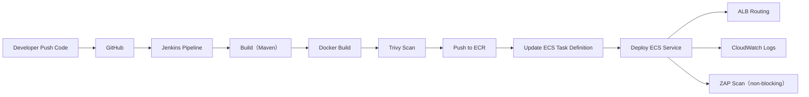

# CI/CD 流程說明（Jenkins + AWS ECS）

本專案建立一套 Jenkins-based CI/CD Pipeline，整合 GitHub、Docker、Amazon ECR 與 ECS Fargate，實現微服務自動化部署流程。  

---  

## 一、整體流程

---

## 二、Pipeline 設計說明

### 1️⃣ Source Control

- 使用 GitHub 作為程式碼來源
- 透過 webhook 自動觸發 Jenkins Job

---

### 2️⃣ Build 階段

- 使用 Maven 進行編譯與測試
- 確保程式可正常建置

---

### 3️⃣ Container Build

- 建立 Docker image
- 使用版本化 tag：

build-xx

👉 確保可 rollback

---

### 4️⃣ Container Security Scan（Trivy）

- 掃描 Docker image
- 檢視 HIGH / CRITICAL 弱點
- 目前設計為：

👉 non-blocking（僅報告，不中斷 pipeline）

---

### 5️⃣ Push to Amazon ECR

- Jenkins 登入 AWS ECR
- 將 image 推送至私有 registry

---

### 6️⃣ ECS Deployment

- 更新 Task Definition（新 image tag）
- 觸發 ECS Service Rolling Deployment

👉 新舊版本逐步替換，避免中斷服務

---

### 7️⃣ API Security Scan（OWASP ZAP）

- 對 ALB HTTPS endpoint 進行掃描
- 輸出 HTML / JSON 報告
- 目前為：

👉 non-blocking（展示用）

---

## 三、Selective Deployment（重點亮點）

本專案支援「差異部署」：

### 機制

- 使用 `git diff` 判斷變更檔案
- 僅部署被修改的 service

例如：

- 修改 `service-a` → 只 deploy service-a
- service-b 不重新部署

---

### 優點

- 減少部署時間
- 降低風險
- 提升 CI/CD 效率

---

## 四、版本控管策略

- Docker image 採用：

build-xx

- ECS Task Definition 綁定特定版本
- 支援 rollback 至舊版本

---

## 五、驗證方式

每次部署可透過以下方式驗證：

1. Jenkins pipeline 成功
2. ECR 出現新 image tag
3. ECS Service 出現新 deployment
4. ALB API 正常回應
5. CloudWatch logs 顯示新 container 正常啟動

---

## 六、設計價值

本 CI/CD Pipeline 具備以下能力：

- 微服務自動化部署
- Container-based delivery
- 雲端原生（ECS Fargate）
- DevSecOps 整合（Trivy + ZAP）
- Selective Deployment（提升效率）
- 可 rollback 的版本控管
