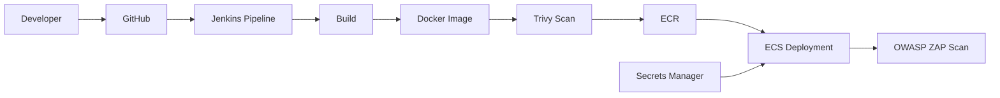

# DevSecOps 流程說明

本專案在 CI/CD Pipeline 中整合基礎 DevSecOps 機制，涵蓋機密管理、Container 安全掃描與 API 弱點掃描，提升整體系統安全性。  

---  

## 一、DevSecOps 架構

---

## 二、Secrets Management（敏感資訊管理）

### 設計方式

- 使用 AWS Secrets Manager 儲存資料庫密碼
- ECS 在執行時動態注入環境變數
- Jenkins 不儲存 DB 密碼

---

### 解決問題

避免：

- 明碼寫在程式碼
- 明碼出現在 Jenkins
- 憑證外洩風險

---

### 設計價值

👉 符合企業常見做法（Secret Externalization）

---

## 三、Container Security（Trivy）

### 掃描內容

- OS layer vulnerabilities
- Java dependencies（JAR）

---

### 掃描時機

- Docker image build 完成後
- push ECR 前

---

### 設計方式

- 使用 Trivy CLI 掃描 image
- 輸出掃描報告（artifact）

---

### Pipeline 策略

目前採：

👉 non-blocking

- 不中斷 pipeline
- 作為安全報告與後續優化依據

---

## 四、API Security（OWASP ZAP）

### 掃描對象

- ALB 對外 HTTPS API

---

### 掃描方式

- Jenkins pipeline 執行 ZAP baseline scan
- 輸出報告：
  - HTML
  - JSON

---

### 掃描結果（實際發現）

- HSTS 未設定
- X-Content-Type-Options 缺失
- Cross-Origin-Resource-Policy 缺失

---

### Pipeline 策略

目前採：

👉 non-blocking

👉 原因：

- 避免阻塞開發流程
- 以展示與改善為主

---

## 五、DevSecOps 策略設計

本專案採用「漸進式安全策略」：

### 第一階段（目前）

- 掃描 + 報告
- 不阻擋 deployment

---

### 未來可升級

- Trivy Security Gate（阻擋 HIGH / CRITICAL）
- ZAP Gate（阻擋高風險漏洞）
- Security Policy as Code

---

## 六、設計價值

本專案展示：

- DevOps → DevSecOps 的轉型能力
- 安全掃描整合於 CI/CD
- Secrets Manager 實務應用
- Container Security（Trivy）
- DAST（OWASP ZAP）
